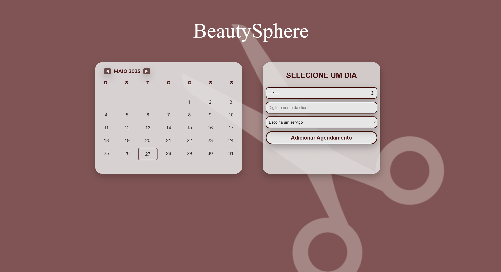

# Salão BeautySphere - Sistema de Agendamento

## Projeto
Este é um sistema web desenvolvido para gerenciamento de agendamentos de um salão, a BeutySphere, nele o recepcionista do estabelecimento poderá salvar agendamentos. 

[Vídeo de demonstração](https://www.youtube.com/watch?v=SeuIDDoVideo)

## Funcionalidades
- Navegação pelo calendário;
- Seleção de dias para vizualiação e gerenciamento;
- Adicionar agendamentos com: nome do cliente e tipo do serviço;
- Editar agendamentos existentes;
- Excluir agendamentos existentes.

## Tecnologias
Front-end:
```shell
HTML5
CSS3
Javascript
```
Back-end:
```shell
Java com Spring Boot
```

## Autores 
- *Nomes*: Alanna Machado, Eduarda Leal, Kauã Rizzo, Letícia Farias.
- *Githubs*: [**@AlannaFm**](https://github.com/AlannaFm), [**@eduarda-leal**](https://github.com/eduarda-leal), [**@rizzoka**](https://github.com/rizzoka), [**@leticia-farias**](https://github.com/leticia-farias).


